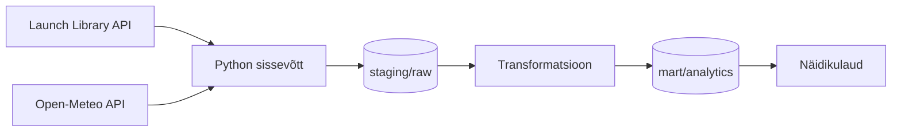

# Globaalsete kosmosestartide ja ilmastikutingimuste analüüs

## Äriküsimus

Millised ettevõtted planeerivad lähiajal enim kosmosestarte ja kui suur on ilmastikust tulenev edasilükkamise risk stardiplatvormi asukohas?

Projekt aitab analüüsida planeeritud kosmosestarte ning hinnata ilmastikutingimustest tulenevaid võimalikke riske stardi toimumisel.

**Mõõdikud**

1. Planeeritud startide arv ettevõtte kohta järgmise 30 päeva jooksul. HELENI kommentaar: visuaal 1 - horisontaalne tulpdiagramm kus on TOP 5 ettevõtte nimed ja planeeritavate startide arv
2. Kõige aktiivsemad stardiplatvormid planeeritud startide arvu järgi. HELENI kommentaar: visuaal 2 - horisontaalne tulpdiagramm kus on TOP 5 asukoha nimed ja planeeritavate startide arv (tulba võime värvida vastavalt TOP5 ettevõtete värvidele, tekib stacked bar chart)
3. Ilmastikurisk stardiplatvormi asukohas. HELENI kommentaar: visuaal 3 - heatmap VÕI "seier" VÕI tulpdiagramm

HELENI kommentaar: dashboardi hea näide https://www.slideteam.net/cyber-risk-impact-and-likelihood-analysis-dashboard.html

## Arhitektuur



Täpsem kirjeldus: `docs/arhitektuur.md`

## Andmestik

| Allikas                           | Tüüp | Ajas muutuv?           | Roll                           |
| --------------------------------- | ---- | ---------------------- | ------------------------------ |
| The Space Devs Launch Library API | API  | Jah, mitu korda päevas | Kosmosestartide andmed         |
| Open-Meteo API                    | API  | Jah, tunnipõhiselt     | Ilmaandmed stardiplatvormidele |

## Stack

| Komponent        | Tööriist                                        |
| ---------------- | ----------------------------------------------- |
| Sissevõtt        | Python                                          |
| Transformatsioon | Python                                          |
| Andmehoidla      | JSON / CSV (Sprint 2), PostgreSQL (planeeritud) |
| Näidikulaud      | Power BI või Apache Superset                    |
| Orkestreerimine  | Käsitsi käivitatavad skriptid                   |

## Käivitamine

```bash
# 1. Klooni repo
git clone <repo-url>

# 2. Liigu projekti kausta
cd Globaalsete-kosmosestartide-ja-ilmastikutingimuste-analuus

# 3. Kopeeri konfiguratsioon
cp .env.example .env

# 4. Käivita andmevoog

python scripts/load_launches.py

python scripts/transform_launches.py

python scripts/create_chart.py
```

Tulemusena tekivad järgmised failid:

* `data/raw/upcoming_launches.json`
* `data/processed/company_launch_counts.csv`
* `output/top_companies.png`

## Saladused ja konfiguratsioon

Projekt kasutab avalikke API-sid.

Konfiguratsioon hoitakse failis `.env`, mille näidis asub failis `.env.example`.

## Andmevoog lühidalt

1. Sissevõtt – Launch Library API-st laaditakse kosmosestartide andmed.
2. Laadimine – andmed salvestatakse JSON-failina kausta `data/raw`.
3. Transformatsioon – arvutatakse ettevõtete planeeritud startide arv.
4. Visualiseerimine – luuakse graafik kõige aktiivsematest ettevõtetest.
5. Tulemus – graafik salvestatakse kausta `output`.

## Andmekvaliteedi testid

Projekt kontrollib:

1. Stardi ID unikaalsust.
2. Puuduvate koordinaatide olemasolu.
3. Kuupäevade korrektsust.

## Projekti struktuur

```text
.
├── README.md
├── .env.example
├── .gitignore
├── docs/
│   ├── arhitektuur.md
│   └── progress.md
├── scripts/
│   ├── test_api.py
│   ├── load_launches.py
│   ├── transform_launches.py
│   └── create_chart.py
├── data/
│   ├── raw/
│   └── processed/
└── output/
```

## Kokkuvõte, puudused ja edasiarendused

### Kokkuvõte

* API ühendus töötab.
* Andmevoog API → JSON → CSV → graafik on realiseeritud.
* Loodud esimene visualiseerimine.

### Puudused

* Open-Meteo API pole veel integreeritud.
* PostgreSQL andmebaasi ei kasutata veel.
* Dashboard on alles planeerimisel.

### Mis edasi

* Lisada ilmaandmed.
* Salvestada andmed PostgreSQL-i.
* Luua Power BI või Apache Supersetiga dashboard.
* Lisada automaatne andmete uuendamine.

## Meeskond

| Nimi         | Roll                               |
| ------------ | ---------------------------------- |
| Katrin Laur  |  |
| Helen Vellau |  |

```
```
