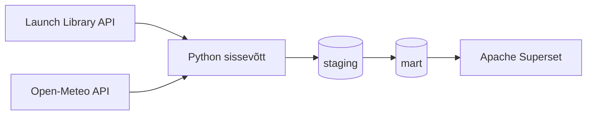
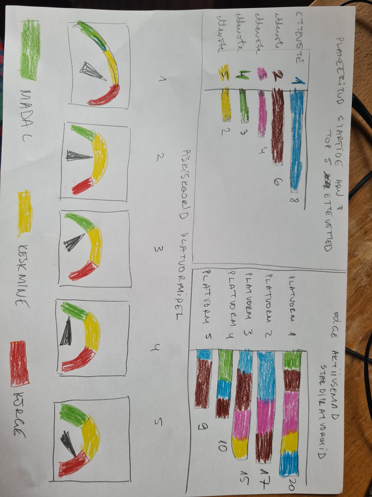
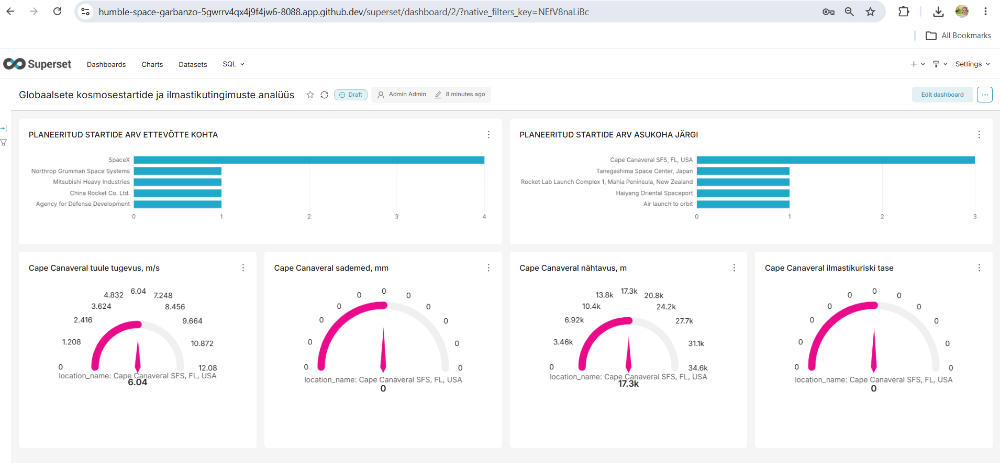

# Globaalsete kosmosestartide ja ilmastikutingimuste analüüs

## Äriküsimus

Millised ettevõtted planeerivad lähiajal enim kosmosestarte ja kui suur on ilmastikust tulenev edasilükkamise risk stardiplatvormi asukohas?

Projekt aitab analüüsida planeeritud kosmosestarte ning hinnata ilmastikutingimustest tulenevaid võimalikke riske stardi toimumisel.

**Mõõdikud**

1. Planeeritud startide arv ettevõtte kohta järgmise 30 päeva jooksul.
2. Planeeritud startide arv stardiplatvormi kohta.
3. Tuulekiirus kõige aktiivsemas stardiplatvormis.
4. Sademete hulk kõige aktiivsemas stardiplatvormis.
5. Nähtavus kõige aktiivsemas stardiplatvormis.
6. Ilmastikuriski skoor, mis arvutatakse tuulekiiruse, sademete ja nähtavuse põhjal.

## Arhitektuur


```mermaid
flowchart LR
    A[Launch Library API] --> B[Python sissevõtt] 
    C[Open-Meteo API] --> B 
    B --> D[(staging)] 
    D --> E[(mart)] 
    E --> F[Apache Superset]
```


Täpsem kirjeldus: `docs/arhitektuur.md`

## Andmestik

| Allikas                           | Tüüp | Ajas muutuv?           | Roll                           |
| --------------------------------- | ---- | ---------------------- | ------------------------------ |
| The Space Devs Launch Library API | API  | Jah, mitu korda päevas | Planeeritud kosmosestardid        |
| Open-Meteo API                    | API  | Jah, tunnipõhiselt     | Stardiplatvormide ilmaandmed |

## Stack

| Komponent        | Tööriist                                        |
| ---------------- | ----------------------------------------------- |
| Sissevõtt        | Python                                          |
| Transformatsioon | Python + SQL                                    |
| Andmehoidla      | PostgreSQL (pgDuckDB)                           |
| Näidikulaud      | Apache Superset                                 |
| Orkestreerimine  | Käsitsi käivitatavad skriptid                   |
| Konteinerid      | Docker Compose                                  |


## Andmevoog lühidalt

1. Launch Library API-st laaditakse järgmise 30 päeva planeeritud kosmosestardid.

2. Andmed salvestatakse PostgreSQL staging kihti (`staging.launches_raw`).

3. Open-Meteo API-st laaditakse stardiplatvormide ilmaandmed ning salvestatakse tabelisse (`staging.weather_raw`).

4. SQL transformatsioonide käigus luuakse järgmised mart-kihi tabelid:
   * `mart.company_launches`
   * `mart.launches_by_location`
   * `mart.weather_risk`
   * `mart.launches_by_location_company`

5. Käivitatakse andmekvaliteedi testid.

6. Tulemused visualiseeritakse Apache Supersetis loodud dashboardil.


## Käivitamine

```bash
# 1. Kopeeri keskkonnamuutujad
cp .env.example .env

# 2. Käivita PostgreSQL 
docker compose up -d

# 3. Kontrolli, et andmebaas töötab
docker compose ps

# 4. Paigalda Pythoni sõltuvused
pip install -r requirements.txt

# 5. Laadi kosmosestardid
python scripts/load_launches.py

# 6. Salvesta kosmosestardid PostgreSQL staging kihti
python scripts/load_to_postgres.py

# 7. Laadi Open-Meteo ilmaandmed PostgreSQL staging kihti
python scripts/load_weather.py

# 8. Käivita transformatsioonid
cat scripts/01_transform.sql | docker compose exec -T db psql -U praktikum -d kosmos
cat scripts/03_location_transform.sql | docker compose exec -T db psql -U praktikum -d kosmos
cat scripts/04_weather_risk.sql | docker compose exec -T db psql -U praktikum -d kosmos
cat scripts/05_location_company_transform.sql | docker compose exec -T db psql -U praktikum -d kosmos

# 9. Käivita andmekvaliteedi testid
cat scripts/02_quality_tests.sql | docker compose exec -T db psql -U praktikum -d kosmos

# 10. Kontrolli loodud mart tabeleid
docker compose exec db psql -U praktikum -d kosmos -c "\dt mart.*"

# 11. Loo visualiseerimine
python scripts/create_chart.py
```
Fail `output/top_companies.png` on näidisvisualiseering ning lõplik dashboard tehakse Apache Supersetis.


## Saladused ja konfiguratsioon

Projekt kasutab .env faili keskkonnamuutujate hoidmiseks.

Reposse lisatakse ainult .env.example.

Päris .env fail on lisatud .gitignore faili ning ei jõua GitHubi.

## Andmekvaliteedi testid

### Staging
- `launch_id` ei tohi olla tühi (NOT NULL).
- `launch_id` peab olema unikaalne.
- `provider_name` ei tohi olla tühi.
- `wind_speed_ms` ei tohi olla NULL.
- 
### Mart
- `company_launches.launch_count` peab olema positiivne.
- `launches_by_location.launch_count` peab olema positiivne.
- `weather_risk_score` peab jääma vahemikku 0–100.

## Projekti struktuur

```text
.
├── README.md
├── .env.example
├── .gitignore
├── compose.yml
├── requirements.txt
├── docs/
│ ├── arhitektuur.md
│ ├── progress.md
│ └── dashboard_sketch.jpeg
├── scripts/
│ ├── load_launches.py
│ ├── load_to_postgres.py
│ ├── load_weather.py
│ ├── create_chart.py
│ ├── test_api.py
│ ├── test_postgres.py
│ ├── 01_transform.sql
│ ├── 02_quality_tests.sql
│ ├── 03_location_transform.sql
│ ├── 04_weather_risk.sql
│ └── 05_location_company_transform.sql
├── data/
│ ├── raw/
│ └── processed/
└── output/
    ├── top_companies.png
    └── dashboard.png
```
## Dashboardi esialgne kavand

Enne Apache Superseti dashboardi loomist koostati käsitsi visand planeeritud visualiseerimisest.

Kavandi eesmärk oli kokku leppida:
- TOP 5 ettevõtete visualiseerimine;
- TOP 5 stardiplatvormide visualiseerimine;
- ilmastikuriski kuvamine;
- dashboardi üldine ülesehitus.



## Lõplik dashboard

Apache Supersetis loodud dashboard võimaldab analüüsida:

- TOP 5 ettevõtteid planeeritud startide arvu järgi;
- TOP 5 stardiplatvorme;
- kõige aktiivsema stardiplatvormi ilmastikunäitajaid;
- ilmastikuriski taset.



## Kokkuvõte, puudused ja edasiarendused

### Kokkuvõte

* Launch Library API ühendus töötab.
* PostgreSQL staging ja mart kihid on realiseeritud.
* Loodud on ettevõtete ja stardiplatvormide analüütikatabelid.
* Rakendatud on andmekvaliteedi testid.
* Docker Compose võimaldab andmebaasi kiiresti käivitada.

### Puudused

* Ilmastikuriski skoor vajab täiendavat valideerimist.
* Riskiskoori mudelit võiks valideerida ajalooliste andmetega.

### Mis edasi

* Täiustada ilmastikuriski mudelit stardiplatvormi-spetsiifiliste piirväärtustega.
* Lisada ajalooliste ilmaandmete analüüs.
* Automatiseerida töövoog Airflow abil.
* Täiendada Apache Superseti dashboardi täiendavate KPI-dega.

## Meeskond

| Nimi         | Roll                               |
| ------------ | ---------------------------------- |
| Katrin Laur | API integratsioonid, ETL protsess, PostgreSQL, SQL transformatsioonid, andmekvaliteedi testid, dokumentatsioon |
| Helen Vellau | Dashboardi kavandamine, Apache Superset visualiseerimised, dashboardi koostamine ja dokumentatsiooni täiendamine |
