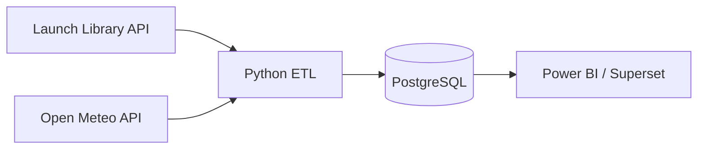

# Kosmosestartide ja ilmastikutingimuste analüüs

## Äriküsimus

Millised ettevõtted planeerivad lähiajal enim kosmosestarte ja kui suur on ilmastikust tulenev edasilükkamise risk stardiplatvormi asukohas?

Projekt aitab visualiseerida kosmosestartide aktiivsust ning hinnata võimalikke ilmastikuga seotud riske enne starti.

---

# Mõõdikud

## 1. Planeeritud startide arv ettevõtte kohta
Loendatakse mitu planeeritud starti on igal ettevõttel järgmise 30 päeva jooksul.

## 2. Ilmastikurisk stardiplatvormis
Arvutatakse halbade ilmastikutingimuste osakaal stardi ajal:
- tugev tuul
- vihm
- halb nähtavus

## 3. Kõige aktiivsemad stardiplatvormid
Loendatakse millistes asukohtades toimub enim starte.

---

# Arhitektuur



---

# Andmestik

| Allikas | Tüüp | Ajas muutuv? | Roll |
|---|---|---|---|
| The Space Devs Launch Library API | API | Jah, regulaarselt | Põhiandmed kosmosestartide kohta | /HELENI KOMMENTAAR - kui sageli on "regulaarselt"?/
| Open-Meteo API | API | Jah, tunnipõhiselt | Ilmaandmed stardiplatvormidele |

---

# Stack

| Komponent | Tööriist |
|---|---|
| Sissevõtt | Python |
| Transformatsioon | SQL |
| Andmehoidla | PostgreSQL |
| Näidikulaud | Power BI |
| Orkestreerimine | Planeeritud järgmistes sprintides |

---

# Käivitamine

```bash
# Repo kloonimine
git clone <repo-url>

# Liikumine projekti kausta
cd globaalsete-kosmosestartide-ja-ilmastikutingimuste-analuus
```

Sprint 1 jooksul tehakse esimesed API testid ja arhitektuuri valideerimine.

---

# Saladused ja konfiguratsioon

Projekt kasutab avalikke API-sid ning autentimist hetkel vaja ei ole.

Kui hiljem lisatakse API võtmeid:
- kasutatakse `.env` faili
- `.env` lisatakse `.gitignore` faili
- repos hoitakse ainult `.env.example` faili

---

# Andmevoog lühidalt

## Sissevõtt
Python skript pärib kosmosestartide andmed Launch Library API-st ning ilmaandmed Open-Meteo API-st.

## Laadimine
Andmed laaditakse PostgreSQL staging kihti.

## Transformatsioon
Andmed ühendatakse stardiplatvormi koordinaatide alusel ning arvutatakse ilmastikuriskid.

## Näidikulaud
Dashboard kuvab:
- startide arv ettevõtte kohta /HELENI KOMMENTAAR - kas visualiseerime TOP5 ettevõtet? Või lisame filtri et kasutaja saab ise valida kas TOP5 või BOTTOM5 või ettevõtte otsing nime järgi?/
- aktiivseimad stardiplatvormid
- ilmastikuriskid

---

# Andmekvaliteedi testid

Projekt kontrollib:
- stardi ID unikaalsust
- puuduvate koordinaatide olemasolu
- kuupäevade korrektsust

---

# Projekti struktuur

```text
.
├── README.md
├── docs/
│   └── arhitektuur.md
├── scripts/
│   └── test_api.py
└── data/
```

---

# Kokkuvõte, puudused ja edasiarendused

## Kokkuvõte
Sprint 1 jooksul:
- valiti äriküsimus
- kaardistati API-d
- loodi arhitektuur
- testiti API ligipääsud

## Puudused
- andmebaasi automaatne laadimine pole veel realiseeritud
- dashboard pole veel loodud

## Mis edasi
- automaatne ETL töövoog
- PostgreSQL integratsioon
- visualiseerimine Power BI-s
- ilmastikuriski täpsem arvutamine

---

# Meeskond

| Nimi | Roll |
|---|---|
| [Liige 1] | 
| [Liige 2] | 
| [Liige 3] |
| [Liige 4] | 
